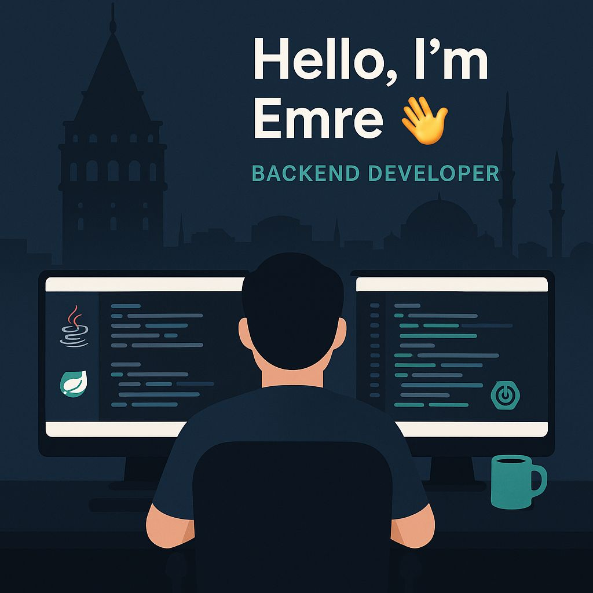

<h1>Hi 👋, I'm Emre | Backend Developer💻</h1>

🎓 A Software Engineering graduate from Bahçeşehir University.

💡 I'm passionate about building scalable backend systems and contributing to meaningful, real-world projects.

🚀 Currently, I'm focused on developing my skills in backend development, especially using Java, Spring Boot, and database systems like MySQL and PostgreSQL.

<h2>🚀 Languages and Tools I Use</h2>

<h2>⚡️ Where to find me</h2>

